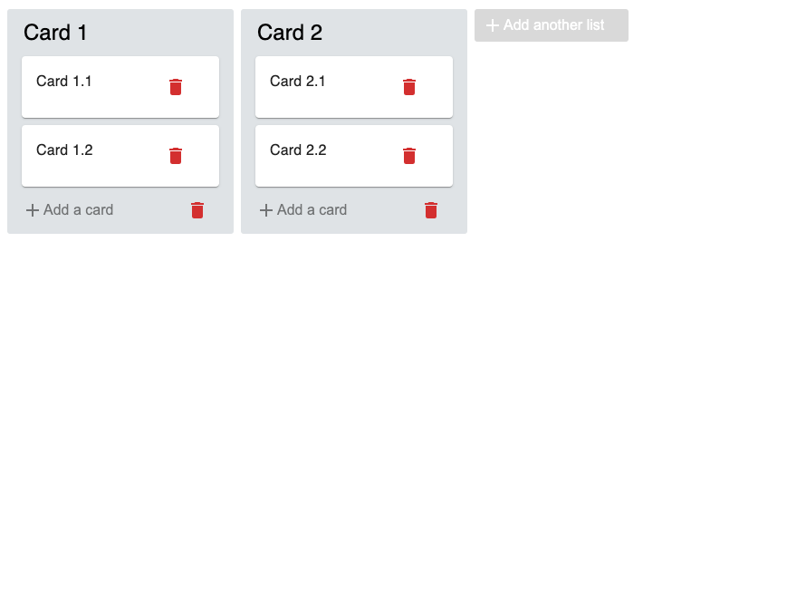

# ChannelMeter Challenge - Trello Clone
<!-- TABLE OF CONTENTS -->
<details>
  <summary>Table of Contents</summary>
  <ol>
    <li>
      <a href="#about-the-project">About The Project</a>
      <ul>
        <li><a href="#built-with">Built With</a></li>
      </ul>
    </li>
    <li>
      <a href="#getting-started">Getting Started</a>
    </li>
    <li><a href="#acknowledgments">Testing</a></li>
  </ol>
</details>


<!-- ABOUT THE PROJECT -->
## About The Project
The goal of this project was to create a [Trello](https://www.trello.com) clone. In general, you'll have a board with columns, and each column has cards. The contents of the cards is just plain text.

<p align="right">(<a href="#top">back to top</a>)</p>

### Requirements 
* User should have the ability to add/ create columns
* User should have the ability to add/ create cards
* Each card should have buttons on it to move to the next/ previous column, or to delete the card
* Columns should have button to delete it
* Cards present in a column when that column is delete should be promoted to the next step

### Results




<p align="right">(<a href="#top">back to top</a>)</p>

### Built With

* [React.js](https://reactjs.org/)
* [Redux](https://redux.js.org/)
* [React-Redux](https://react-redux.js.org/)
* [Material-UI](https://mui.com/)
* [React-Beautiful-DnD](https://www.npmjs.com/package/react-beautiful-dnd)

<p align="right">(<a href="#top">back to top</a>)</p>


<!-- GETTING STARTED -->
## Getting Started

Clone the repo and navigate to the src directory in your terminal.

* Install node modueles
  ```
  npm install 
  ```
* Start app
  ```
  npm start
  ```

<p align="right">(<a href="#top">back to top</a>)</p>


### Testing
Navigate to root directory and run this command

  ```
  npm run test
  ```


